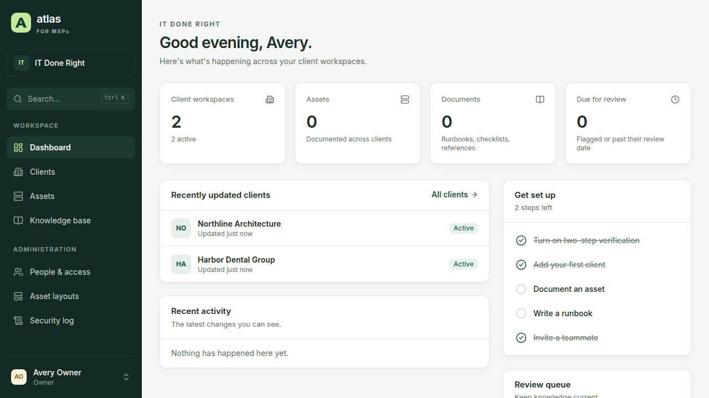
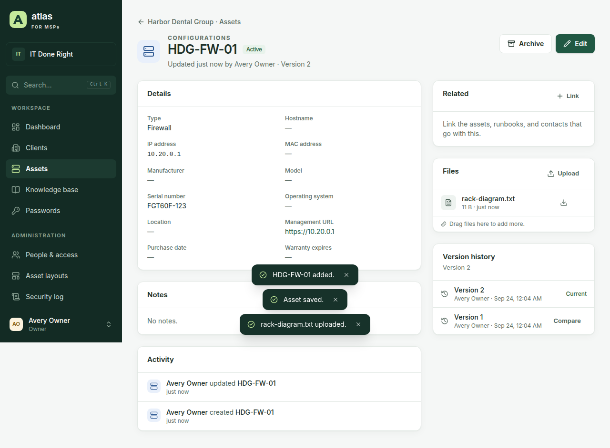
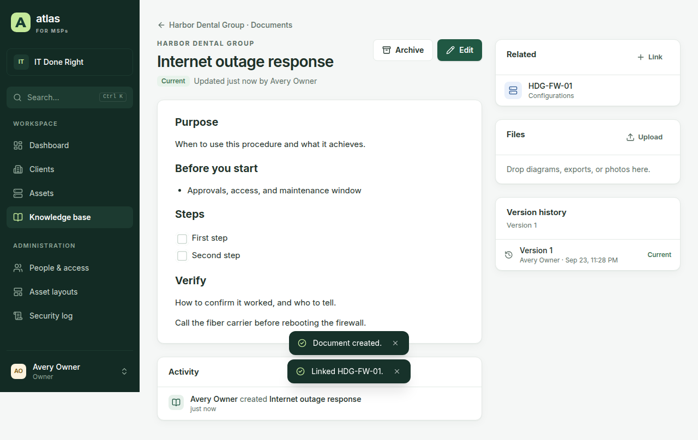
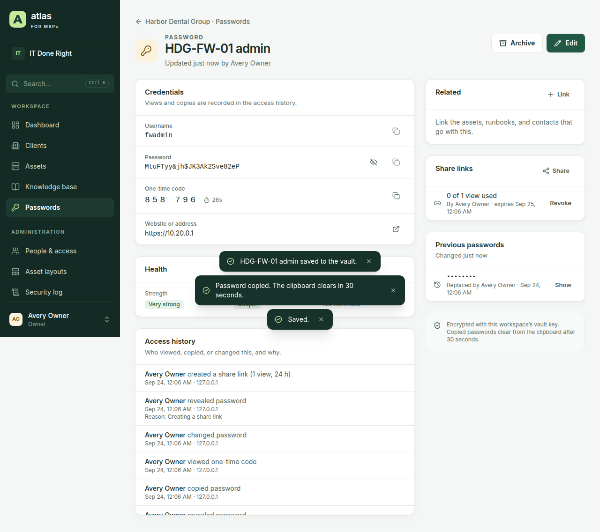
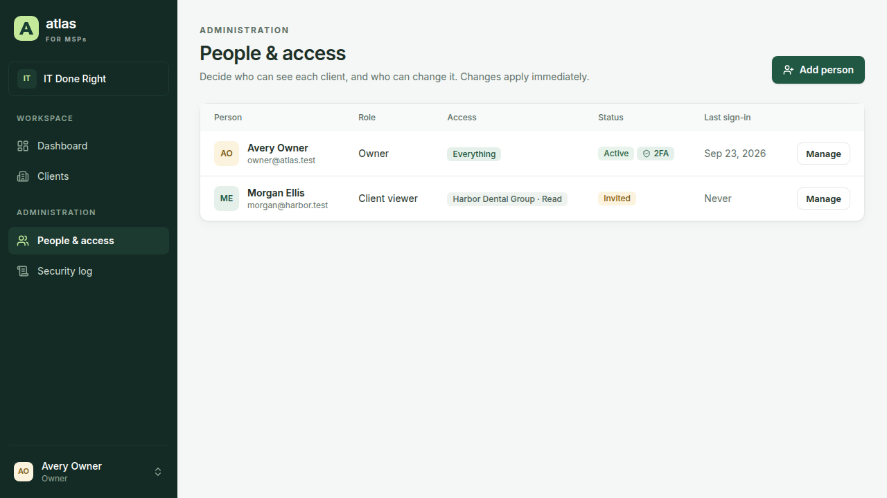

<div align="center">

# MSP Atlas

**Self-hosted IT documentation and password management for managed service providers.**

Client workspaces, flexible assets, runbooks, and an encrypted credential vault in one
application, with per-client access for your technicians and read-only access for the clients
you support.

[](CHANGELOG.md)
[](#local-development)
[](docs/DEPLOYMENT.md)
[](#verification)

[**Product site**](https://ithealthtech.github.io/nexus-atlas/) ·
[Install](https://ithealthtech.github.io/nexus-atlas/install.html) ·
[Security model](SECURITY.md) ·
[Latest release](https://github.com/ithealthtech/nexus-atlas/releases/latest) ·
[Documentation](docs/)



</div>

---

## The idea

An MSP's documentation and its passwords belong together: the firewall runbook is useless
without the firewall's admin credential, and the credential is dangerous without a record of
who used it and why. Most MSPs split them across a documentation tool and a password manager,
or keep both in a hosted product whose data they don't control.

Atlas keeps them in one place you host yourself. Documentation is structured (assets built
from layouts, linked to runbooks, contacts, and locations) and every change is versioned. The
vault uses server-side envelope encryption: each organization has its own data key, wrapped by
a master key that never enters the database. Every reveal, copy, change, and share is recorded.

Three consequences worth knowing before you deploy:

- **The master key is the vault.** Lose it and passwords and backups can't be decrypted; store
  it with the database and a stolen backup gives everything away. Keep it separately.
- **Administrators can read every password.** Atlas is not end-to-end encrypted like a personal
  password manager. It records every read instead, and lets you restrict entries to named people.
- **Clients a person can't access look exactly like missing ones.** Guessing another client's
  ID returns not-found, never forbidden.

## Product tour

### Client workspace

Each client has its own assets, documents, passwords, contacts, locations, and activity. Search
with Ctrl+K finds clients, assets (including by IP address or serial number), document text,
and contacts, and returns only what you're allowed to see.



### Runbooks and knowledge base

A rich-text editor with checklists, tables, and code blocks, templates for runbooks and
onboarding, review dates, and line-by-line version comparison. Runbooks link to the assets they
describe.



### Password vault

Logins with live one-time codes, BitLocker recovery keys, a generator, strength and reuse
warnings, rotation reminders, restricted entries, required reasons, and one-time share links
encrypted in the browser.



### People and access

Six roles, per-client access levels, and groups. Changes apply to people who are already
signed in, immediately.



## Architecture

```text
Browser (React, strict CSP)
        |
        v
apps/server  Fastify        Host/Origin/CSRF checks, sessions, MFA, API keys, per-client authorization
        |
        +--> services       Documentation, vault (envelope encryption), imports, backups, status
        |
        +--> KeyProvider    Master key from ATLAS_MASTER_KEY or a key file, never stored in the database
        |
        v
packages/db  Drizzle        PostgreSQL 16, versioned migrations applied automatically at startup
        +
data/attachments            Uploaded files, outside the web root under random names
```

| Path | What it is |
| --- | --- |
| `apps/server` | Fastify API, background jobs, and the command-line tools (backup, restore, migration) |
| `apps/web` | React, Vite, TanStack Router and Query, Tailwind |
| `packages/shared` | zod schemas, roles, access levels, and API types shared by server and web |
| `packages/db` | Drizzle schema and SQL migrations |
| `deploy` | Docker Compose with Caddy (automatic HTTPS) and the Windows service installer |
| `e2e` | Playwright browser tests with axe accessibility checks |
| `legacy` | The 0.2 prototype, kept for `npm run migrate-legacy` |
| `integrations/bitlocker` | BitLocker collector prototype, the reference for the post-v1 RMM collector |

Full detail in [docs/ARCHITECTURE.md](docs/ARCHITECTURE.md).

## Security model

Every browser request runs these checks, in order:

1. The `Host` and `Origin` match `PUBLIC_URL`, and cross-site requests are refused.
2. The session cookie (`HttpOnly`, `Secure`, `SameSite=Strict`, `__Host-`) resolves to an active,
   unexpired session, and every change carries the session's CSRF token.
3. The session has finished its sign-in stages: password, then two-step verification (required
   for staff), then any required password change.
4. The person's effective level for the client — the highest of their baseline, grants, and
   groups, capped by their role — allows the action.
5. Passwords additionally need _edit + passwords_, pass restriction lists, and ask for a reason
   when the client requires one. The reveal is recorded.

API keys replace steps 2 and 3 with a hashed bearer key limited to its scopes and to the
documentation and vault endpoints. The security log is hash-chained by database triggers with a
checkpoint signed by a key derived from the master key.

Full detail in [SECURITY.md](SECURITY.md) and [docs/IDENTITY.md](docs/IDENTITY.md).

## Install

**Docker (Linux)** — set `PUBLIC_URL`, `ATLAS_DOMAIN`, `POSTGRES_PASSWORD`, and
`ATLAS_MASTER_KEY` in `.env`, then:

```bash
docker compose -f deploy/docker-compose.yml --env-file .env up -d
docker compose -f deploy/docker-compose.yml logs app | grep "setup code"
```

**Windows Server** — extract the Windows package from the
[latest release](https://github.com/ithealthtech/nexus-atlas/releases/latest), then from an elevated prompt:

```powershell
.\deploy\windows\Install-Atlas.ps1 -PublicUrl https://atlas.example.com -DatabaseUrl "postgres://atlas:<password>@localhost:5432/atlas"
```

Open `PUBLIC_URL` and enter the setup code to create the owner account. No default
administrator or password exists. See [docs/DEPLOYMENT.md](docs/DEPLOYMENT.md).

## Local development

Node.js 22 or later and PostgreSQL 16 are required.

```powershell
npm install
Set-Content .env "DATABASE_URL=postgres://postgres@127.0.0.1:5432/atlas"
npm run build
npm run dev
```

The API runs on `http://127.0.0.1:4318` and the web app with hot reload on
`http://127.0.0.1:5173`. In development a master key file is created in `data/` on first run.

`npm run build:demo -w @atlas/web` builds a clickable demo that answers API calls from sample
data in the browser. The demo code is left out of the production build.

## Verification

```powershell
npm run lint
npm run typecheck
npm test
npm run build
npm run test:e2e
npm run perf -w @atlas/server
npm audit --omit=dev
```

`npm test` (needs `TEST_DATABASE_URL`) covers sign-in and MFA, per-client isolation, restricted
passwords, the vault's encryption and access history, audit-chain tamper detection, imports,
exports, backup and restore round trips, and request hardening.

The Playwright gate (needs `E2E_DATABASE_URL`) walks first-run setup through every workflow and
checks WCAG 2.2 AA with axe on every screen in light, dark, and phone layouts, plus a
keyboard-only walkthrough. `npm run perf` times the busiest requests against a 2,000-client MSP.

CI runs all of these on every pull request, plus a Windows build and a Docker image build.
Results for each milestone are in [docs/VERIFICATION.md](docs/VERIFICATION.md).

## Current boundary

Version 1.0 covers documentation, the vault, accounts and security, the REST API, Hudu and CSV
import, per-client exports, encrypted backups with verified restore, the system status page, a
read-only client portal, and Docker or Windows hosting.

Not in 1.0: single sign-on with Microsoft Entra ID, PSA and RMM integrations (ConnectWise first),
a browser autofill extension, IT Glue and ITBoost importers, and multi-tenant cloud hosting. See
[docs/ROADMAP.md](docs/ROADMAP.md).

## Documentation

| Operators | Users | Developers |
| --- | --- | --- |
| [Deployment](docs/DEPLOYMENT.md) | [User guide](docs/USER-GUIDE.md) | [Architecture](docs/ARCHITECTURE.md) |
| [Administrator guide](docs/ADMIN-GUIDE.md) | [Data in and out](docs/DATA.md) | [Identity and permissions](docs/IDENTITY.md) |
| [Security model](SECURITY.md) | [Changelog](CHANGELOG.md) | [Verification log](docs/VERIFICATION.md) |
| [Roadmap](docs/ROADMAP.md) | [Product site](https://ithealthtech.github.io/nexus-atlas/) | [BitLocker integration](docs/BITLOCKER.md) |
| | | [Contributing](CONTRIBUTING.md) |

Read [docs/DEPLOYMENT.md](docs/DEPLOYMENT.md), [SECURITY.md](SECURITY.md), and the
[administrator guide](docs/ADMIN-GUIDE.md) before storing client credentials.

## Security

Report vulnerabilities privately through [SECURITY.md](SECURITY.md) — never a public issue.

## Trademarks

Hudu, IT Glue, ITBoost, and ConnectWise are trademarks of their respective owners. Microsoft,
Microsoft 365, Windows, Windows Hello, and BitLocker are trademarks of the Microsoft group of
companies. MSP Atlas is not affiliated with or endorsed by any of them.
