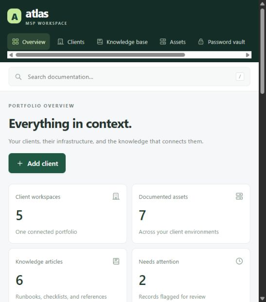

# Nexus Atlas

A self-hosted MSP documentation and password-platform project. **Version 0.1 is a local development foundation, not a production credential manager.** Atlas is a working name.



## Run locally

Requires Node.js 24.18 or later in the 24.x line. No package installation or external service is required for this first development slice.

```powershell
cd C:\dev\msp-documentation
npm start
```

Open http://127.0.0.1:4318 and select **Open sample workspace**. The process listens only on loopback. `npm run dev` restarts the server when server files change; reload the browser after frontend changes. `PORT` changes the local port; `ATLAS_DATABASE` selects a development SQLite file.

The demo includes four synthetic clients and two selectable personas: an MSP technician with editing access and a Harbor Dental client viewer with read-only access. These are **demonstration identities, not authenticated user accounts**. Anyone able to access the local application can choose either persona. Do not expose this server through a proxy, tunnel, or network binding.

## Working features

- Portfolio overview and client workspaces; create clients with contact details.
- Asset and document creation, editing, review dates, status, and simple heading formatting.
- Persistent SQLite records with transactional revision history and restoration as a new version.
- Optimistic concurrency: stale edits are rejected rather than overwriting newer changes.
- Bidirectional links between records in the same client workspace.
- Search across authorized documentation, assets, and client names; status filtering.
- Activity records for creation, changes, links, and exports.
- Client documentation JSON export, including revisions and relationships.
- Server-enforced demo-role/client scope; read-only client view.
- BitLocker module with asset-linked synthetic metadata and an imported RMM collector reference.
- Responsive interface, keyboard search shortcut, semantic forms, and accessible names.

## Explicit limits

- Password vault, BitLocker recovery, sharing, enrollment, ingestion, and encrypted import are disabled at the API layer.
- No real accounts, MFA, Entra/SSO, attachments, automated discovery, or external integrations yet.
- Documentation is ordinary plaintext in a local database; never put passwords or sensitive client data into this development release.
- SQLite is a development persistence adapter. The planned production target is PostgreSQL with independently tested tenant isolation, production identity, and operational controls.
- JSON exports are documentation exports, not complete system backups. There is no restore/import UI or production backup system yet.
- Activity events are local database records, not an immutable compliance audit trail.
- No production build/deployment package is provided. `NODE_ENV=production` deliberately refuses startup.

## BitLocker consolidation

The former standalone BitLocker project is preserved under `integrations/bitlocker` as source/reference. Atlas is now the owning application; no separate vault service is launched. The navigation and synthetic inventory use Atlas's own asset authorization. Copied Cloudflare routes and identity headers are not mounted or trusted.

See [BitLocker integration status](docs/BITLOCKER.md). The user's intended deployment method is an RMM-run Windows agent. Production collection remains gated; no endpoints were enrolled or queried.

## Verification

```powershell
npm run check
# Optional Windows-only mocked collector and crypto interoperability check:
Push-Location integrations/bitlocker
node tests/collector.mjs
Pop-Location
```

The main suite verifies client/MSP boundaries, read-only restrictions, relationships, concurrency, revisions, persistence across reopening, HTTP sessions, CSRF/origin/Host protections, production refusal, and secret-storage gates. Tests use isolated synthetic databases. The collector tests mock Windows inventory and never query real BitLocker recovery keys.

See [security and architecture](docs/ARCHITECTURE.md) and [next milestones](docs/ROADMAP.md).

## Source layout

`server/` — local HTTP boundary, data store, and gated BitLocker inventory.

`public/` — dependency-free browser application and styling.

`tests/` — isolated application and HTTP tests.

`integrations/bitlocker/` — imported collector/crypto/prototype reference and original validation history.

`data/` — local generated database, excluded from source control.

`artifacts/` — preview logs and visual verification, excluded from source control.
