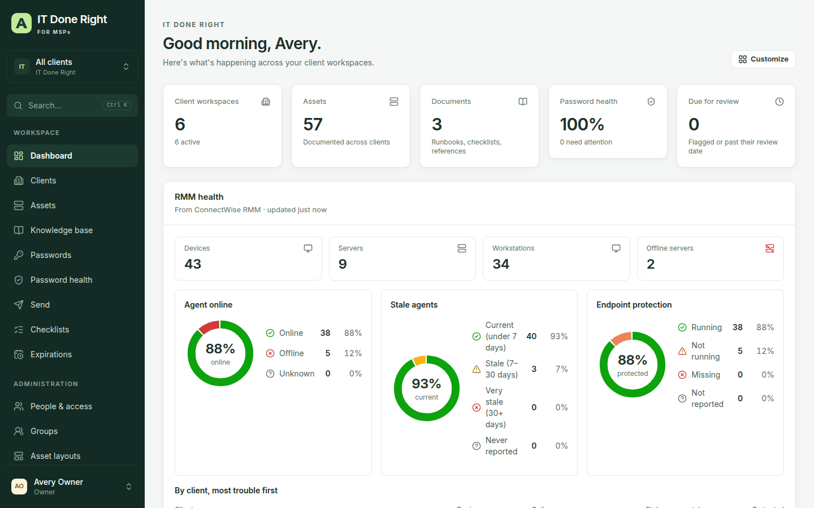
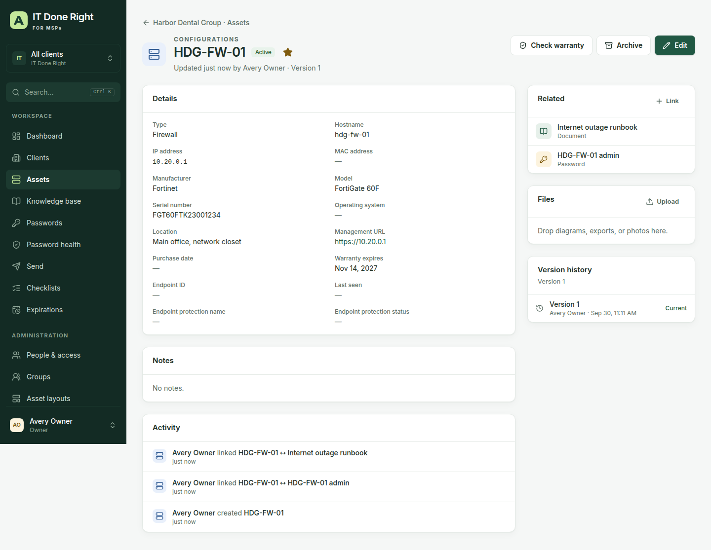
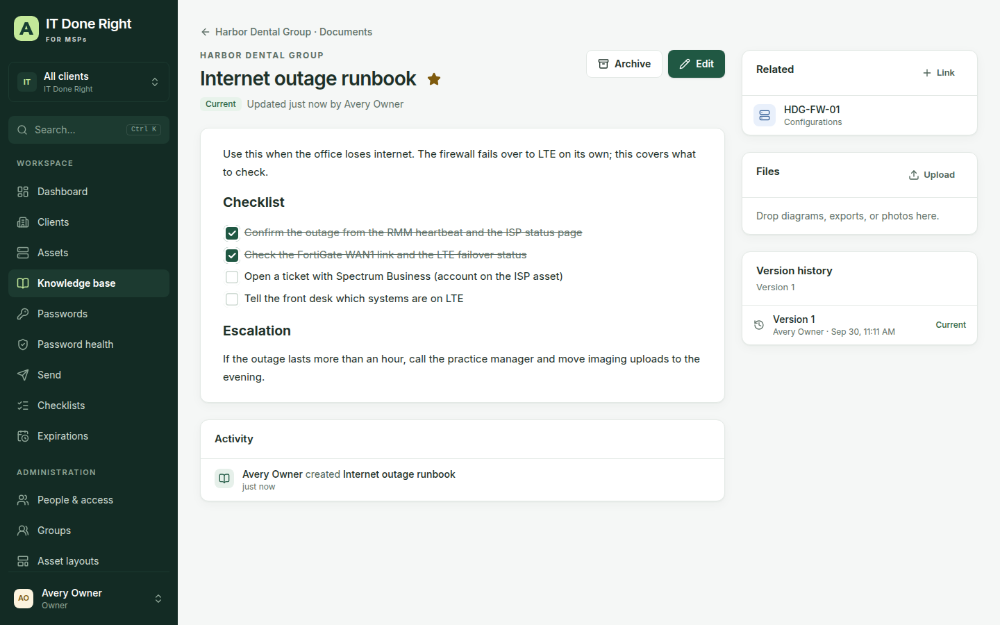
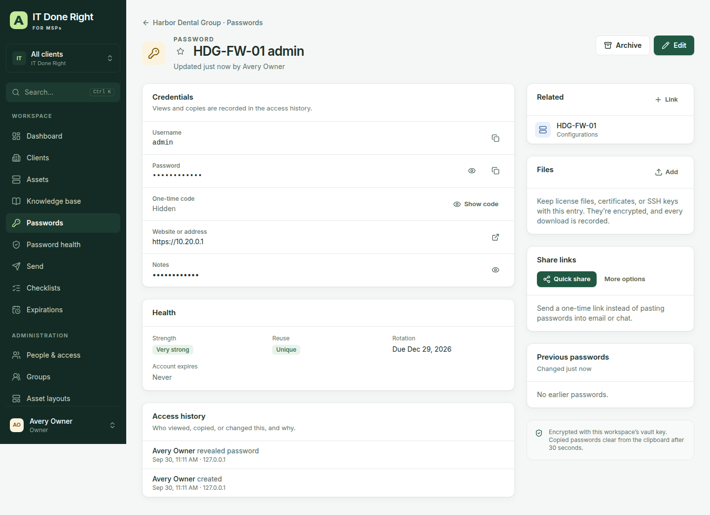
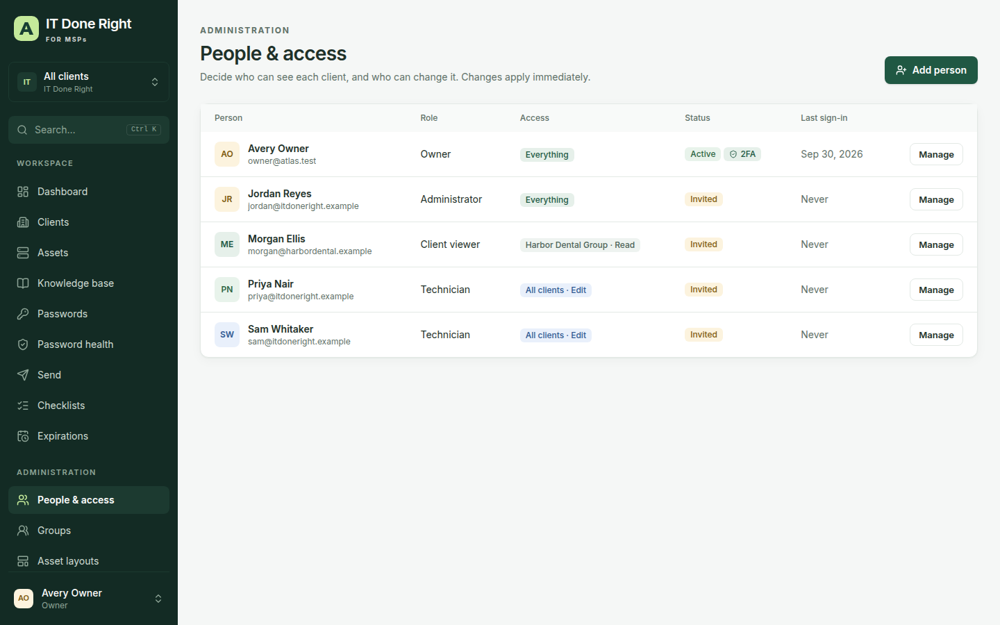

<div align="center">

# MSP Atlas

**Self-hosted IT documentation and password management for managed service providers.**

Client workspaces, flexible assets, runbooks, runnable checklists, and an encrypted credential
vault in one application, kept current by syncs from ConnectWise RMM and Microsoft 365, with
per-client access for your technicians and read-only access for the clients you support.

[](CHANGELOG.md)
[](#local-development)
[](docs/DEPLOYMENT.md)
[](#verification)

[**Product site**](https://ithealthtech.github.io/nexus-atlas/) ·
[Install](https://ithealthtech.github.io/nexus-atlas/install.html) ·
[Security model](SECURITY.md) ·
[Latest release](https://github.com/ithealthtech/nexus-atlas/releases/latest) ·
[Documentation](docs/)



</div>

---

## The idea

An MSP's documentation and its passwords belong together: the firewall runbook is useless
without the firewall's admin credential, and the credential is dangerous without a record of
who used it and why. Most MSPs split them across a documentation tool and a password manager,
or keep both in a hosted product whose data they don't control.

Atlas keeps them in one place you host yourself. Documentation is structured (assets built
from layouts, linked to runbooks, contacts, and locations) and every change is versioned. The
vault uses server-side envelope encryption: each organization has its own data key, wrapped by
a master key that never enters the database. Every reveal, copy, change, and share is recorded.

Three consequences worth knowing before you deploy:

- **The master key is the vault.** Lose it and passwords and backups can't be decrypted; store
  it with the database and a stolen backup gives everything away. Keep it separately.
- **Administrators can read every password.** Atlas is not end-to-end encrypted like a personal
  password manager. It records every read instead, and lets you restrict entries to named people.
- **Clients a person can't access look exactly like missing ones.** Guessing another client's
  ID returns not-found, never forbidden.

## Product tour

### Client workspace

Each client has its own assets, documents, passwords, contacts, locations, and activity. Search
with Ctrl+K finds clients, assets (including by IP address or serial number), document text,
and contacts, and returns only what you're allowed to see.



### Runbooks and knowledge base

A rich-text editor with checklists, tables, and code blocks, templates for runbooks and
onboarding, review dates, and line-by-line version comparison. Runbooks link to the assets they
describe.



### Password vault

Logins with live one-time codes, BitLocker recovery keys, a generator, strength and reuse
warnings, rotation reminders, restricted entries, required reasons, and one-time share links
encrypted in the browser.



### People and access

Six roles, per-client access levels, and groups. Changes apply to people who are already
signed in, immediately. Staff can sign in with Microsoft Entra ID; accounts are never created
by signing in, and an administrator confirms each Microsoft account the first time.



### More in the vault

Secure notes, encrypted files on entries, folders, favorites, custom fields, and bulk changes.
**Send** shares text or a file once, encrypted in the browser. A password health report checks
for weak, reused, old, and breached passwords (only the first five characters of a hash ever
leave the server). Vault policies set rules for the whole vault, emergency access lets a named
person in after a waiting period, and automated rotation changes local administrator and
service account passwords on a schedule through the RMM.

### Checklists and client pages

Reusable checklists run step by step for a client, recording who ticked each step and when,
with an assignee and a due date, from a built-in template library or your own. Each client
also gets a relationship map of how its items link together, domain and SSL certificate
trackers, an expirations view, and a monthly report.

### Integrations

| | What comes in |
| --- | --- |
| **ConnectWise RMM (Asio)** | Companies, sites, contacts, and devices with installed software, sign-ins, warranty dates, and endpoint protection; tickets (read-only); and, if you turn them on, links and ticket notes written back |
| **Microsoft 365** | Each client tenant's users, subscriptions with seats used, domains, and administrators, from one multi-tenant app registration |
| **BitLocker** | Recovery keys and each volume's encryption status, from a read-only script your RMM runs, or from an RMM custom field. See [docs/BITLOCKER.md](docs/BITLOCKER.md) |
| **Hudu and CSV** | One-time imports, safe to re-run |
| **SIEM** | Security events and password access streamed by HTTPS webhook or syslog |

A REST API with scoped keys and an OpenAPI description covers the rest.

### Outside the browser tab

A browser extension for Edge and Chrome fills logins from the vault on matching sites, and
Atlas for Windows (preview) gives technicians quick search and credential copy from the
desktop. Both sign in through Atlas with their own revocable sessions.

## Architecture

```text
Browser (React, strict CSP)
        |
        v
apps/server  Fastify        Host/Origin/CSRF checks, sessions, MFA, API keys, per-client authorization
        |
        +--> services       Documentation, vault (envelope encryption), imports, backups, status
        |
        +--> KeyProvider    Master key from ATLAS_MASTER_KEY or a key file, never stored in the database
        |
        v
packages/db  Drizzle        PostgreSQL 16, versioned migrations applied automatically at startup
        +
data/attachments            Uploaded files, outside the web root under random names
```

| Path | What it is |
| --- | --- |
| `apps/server` | Fastify API, background jobs, and the command-line tools (backup, restore, migration) |
| `apps/web` | React, Vite, TanStack Router and Query, Tailwind |
| `apps/extension` | The browser extension for Edge and Chrome |
| `apps/windows` | Atlas for Windows (.NET), in preview |
| `packages/shared` | zod schemas, roles, access levels, and API types shared by server and web |
| `packages/db` | Drizzle schema and SQL migrations |
| `deploy` | Docker Compose with Caddy (automatic HTTPS), the Linux and Windows installers, and the RMM rotation script |
| `e2e` | Playwright browser tests with axe accessibility checks |
| `legacy` | The 0.2 prototype, kept for `npm run migrate-legacy` |
| `integrations/bitlocker` | The standalone BitLocker prototype the collector was ported from. Reference only; nothing in it runs |

Full detail in [docs/ARCHITECTURE.md](docs/ARCHITECTURE.md).

## Security model

Every browser request runs these checks, in order:

1. The `Host` and `Origin` match `PUBLIC_URL`, and cross-site requests are refused.
2. The session cookie (`HttpOnly`, `Secure`, `SameSite=Strict`, `__Host-`) resolves to an active,
   unexpired session, and every change carries the session's CSRF token.
3. The session has finished its sign-in stages: password, then two-step verification (required
   for staff), then any required password change.
4. The person's effective level for the client — the highest of their baseline, grants, and
   groups, capped by their role — allows the action.
5. Passwords additionally need _edit + passwords_, pass restriction lists, and ask for a reason
   when the client requires one. The reveal is recorded.

API keys replace steps 2 and 3 with a hashed bearer key limited to its scopes and to the
documentation and vault endpoints. The browser extension and the Windows app use their own
device sessions. Scripts that report from a machine (password rotation, the BitLocker
collector) hold a token that can do that one job and read nothing. The security log is
hash-chained by database triggers with a checkpoint signed by a key derived from the master key.

Full detail in [SECURITY.md](SECURITY.md) and [docs/IDENTITY.md](docs/IDENTITY.md).

## Install

**Linux, one command** — the installer sets up Docker, the database, HTTPS, and a master key:

```bash
curl -fsSL https://raw.githubusercontent.com/ithealthtech/nexus-atlas/main/deploy/linux/install-atlas.sh -o install-atlas.sh
sudo bash install-atlas.sh --public-url https://atlas.example.com
```

**Docker (Linux), by hand** — set `PUBLIC_URL`, `ATLAS_DOMAIN`, `POSTGRES_PASSWORD`, and
`ATLAS_MASTER_KEY` in `.env`, then:

```bash
docker compose -f deploy/docker-compose.yml --env-file .env up -d
docker compose -f deploy/docker-compose.yml logs app | grep "setup code"
```

**Windows Server** — extract the Windows package from the
[latest release](https://github.com/ithealthtech/nexus-atlas/releases/latest), then from an elevated prompt:

```powershell
.\deploy\windows\Install-Atlas.ps1 -PublicUrl https://atlas.example.com -DatabaseUrl "postgres://atlas:<password>@localhost:5432/atlas"
```

Open `PUBLIC_URL` and enter the setup code to create the owner account. No default
administrator or password exists. Later versions install from **Administration → Updates**.
See [docs/DEPLOYMENT.md](docs/DEPLOYMENT.md) for the installer's options.

## Local development

Node.js 22 or later and PostgreSQL 16 are required.

```powershell
npm install
Set-Content .env "DATABASE_URL=postgres://postgres@127.0.0.1:5432/atlas"
npm run build
npm run dev
```

The API runs on `http://127.0.0.1:4318` and the web app with hot reload on
`http://127.0.0.1:5173`. In development a master key file is created in `data/` on first run.

`npm run build:demo -w @atlas/web` builds a clickable demo that answers API calls from sample
data in the browser. The demo code is left out of the production build.

## Verification

```powershell
npm run lint
npm run typecheck
npm test
npm run build
npm run test:e2e
npm run perf -w @atlas/server
npm audit --omit=dev
```

`npm test` (needs `TEST_DATABASE_URL`) covers sign-in and MFA, per-client isolation, restricted
passwords, the vault's encryption and access history, audit-chain tamper detection, imports,
exports, backup and restore round trips, and request hardening.

The Playwright gate (needs `E2E_DATABASE_URL`) walks first-run setup through every workflow and
checks WCAG 2.2 AA with axe on every screen in light, dark, and phone layouts, plus a
keyboard-only walkthrough. `npm run perf` times the busiest requests against a 2,000-client MSP.

CI runs all of these on every pull request, plus a Windows build and a Docker image build.
Results for each milestone are in [docs/VERIFICATION.md](docs/VERIFICATION.md).

## Current boundary

Atlas covers documentation, the vault, checklists, accounts and security with Microsoft Entra
sign-in, the REST API, ConnectWise RMM and Microsoft 365 sync, BitLocker key collection, Hudu
and CSV import, per-client exports, encrypted backups with verified restore, in-app updates, a
read-only client portal, a browser extension, and Docker or Windows hosting. The
[changelog](CHANGELOG.md) lists what each release added.

Know these limits before relying on it:

- **Integrations are tested against stand-ins.** Automated tests run against fake ConnectWise,
  Microsoft, and Hudu services. ConnectWise RMM sync has been run against a real tenant; treat
  anything newer as needing a pilot of your own.
- **The BitLocker collector has not been run on real hardware yet,** and its script isn't
  code-signed. Pilot it on one machine first.
- **Atlas for Windows is a preview.**

Not included: other PSA and RMM integrations (Autotask, HaloPSA, NinjaOne, Datto), network
discovery, IT Glue and ITBoost importers, mobile apps, and multi-tenant cloud hosting. See
[docs/ROADMAP.md](docs/ROADMAP.md).

## Documentation

| Operators | Users | Developers |
| --- | --- | --- |
| [Deployment](docs/DEPLOYMENT.md) | [User guide](docs/USER-GUIDE.md) | [Architecture](docs/ARCHITECTURE.md) |
| [Administrator guide](docs/ADMIN-GUIDE.md) | [Data in and out](docs/DATA.md) | [Identity and permissions](docs/IDENTITY.md) |
| [Security model](SECURITY.md) | [Changelog](CHANGELOG.md) | [Verification log](docs/VERIFICATION.md) |
| [Roadmap](docs/ROADMAP.md) | [Product site](https://ithealthtech.github.io/nexus-atlas/) | [BitLocker](docs/BITLOCKER.md) |
| | | [Contributing](CONTRIBUTING.md) |

Read [docs/DEPLOYMENT.md](docs/DEPLOYMENT.md), [SECURITY.md](SECURITY.md), and the
[administrator guide](docs/ADMIN-GUIDE.md) before storing client credentials.

## Security

Report vulnerabilities privately through [SECURITY.md](SECURITY.md) — never a public issue.

## Trademarks

Hudu, IT Glue, ITBoost, and ConnectWise are trademarks of their respective owners. Microsoft,
Microsoft 365, Windows, Windows Hello, and BitLocker are trademarks of the Microsoft group of
companies. MSP Atlas is not affiliated with or endorsed by any of them.
